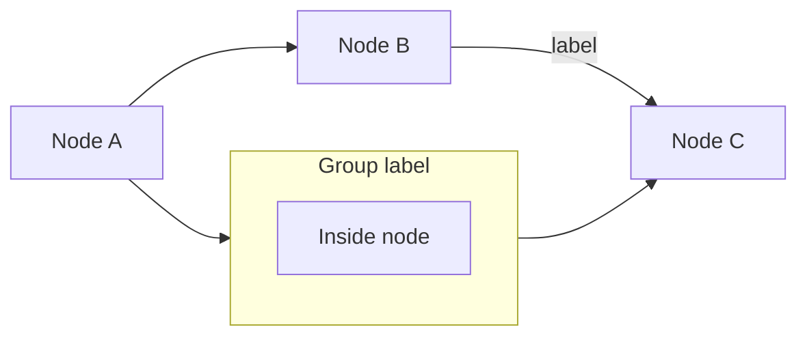
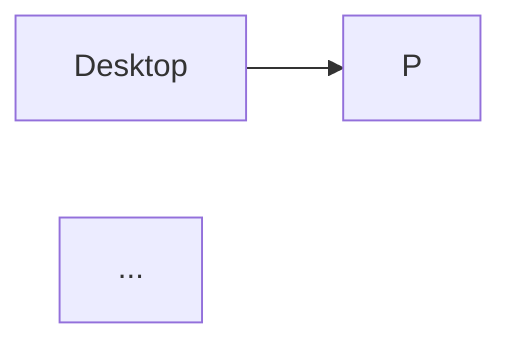

# Mermaid Diagrams

Architecture diagrams are authored as Mermaid `.mmd` files and pre-rendered to SVGs for the static website. The README uses inline mermaid code blocks (rendered natively by GitHub).

## Source files

| File | Purpose |
|------|---------|
| `web/arch-explicit.mmd` | Explicit proxy mode diagram |
| `web/arch-transparent.mmd` | Transparent proxy mode diagram |
| `web/arch-dns.mmd` | DNS resolver mode diagram |
| `web/mermaid-config.json` | Custom theme matching the website palette |

The `.mmd` files are the **source of truth**. The `.svg` files are generated artifacts. The README contains the same mermaid syntax inline as fenced code blocks.

When updating a diagram, update **both** the `.mmd` file and the corresponding mermaid code block in `README.md`.

## Tool setup

The mermaid CLI (`mmdc`) is installed via mise:

```toml
# mise.toml
"npm:@mermaid-js/mermaid-cli" = "latest"
```

Ensure it's installed:

```bash
mise install
```

## Generating SVGs

Generate a single diagram:

```bash
mise exec -- mmdc \
  -i web/arch-explicit.mmd \
  -o web/arch-explicit.svg \
  -c web/mermaid-config.json \
  -b transparent
```

Generate all three:

```bash
for mode in explicit transparent dns; do
  mise exec -- mmdc \
    -i "web/arch-${mode}.mmd" \
    -o "web/arch-${mode}.svg" \
    -c web/mermaid-config.json \
    -b transparent
done
```

## Previewing

To visually inspect a diagram, render to PNG in `tmp/`:

```bash
mise exec -- mmdc \
  -i web/arch-explicit.mmd \
  -o tmp/arch-explicit.png \
  -c web/mermaid-config.json \
  -b transparent
```

Then use the Read tool on the PNG to see the result.

## Custom theme

The file `web/mermaid-config.json` defines a custom Mermaid theme that matches the website's color palette:

| Theme variable | Value | Maps to site variable |
|---------------|-------|----------------------|
| `primaryColor` | `#12121a` | `--bg-card` |
| `primaryBorderColor` | `#00ff41` | `--green` / `--accent` |
| `primaryTextColor` | `#c8c8d0` | `--text` |
| `lineColor` | `#00e5ff` | `--cyan` |
| `clusterBkg` | `rgba(0,255,65,0.06)` | `--accent-glow` |
| `clusterBorder` | `rgba(0,255,65,0.3)` | green with transparency |
| `background` | `transparent` | sits on site's `--bg` |
| `fontFamily` | `monospace` | `--font-mono` |

If the website palette changes, update `mermaid-config.json` to match.

## Mermaid syntax quick reference

The diagrams use `graph LR` (left-to-right flowchart):



Key syntax:
- `graph LR` — left to right. Use `graph TD` for top to bottom.
- `A["Label"]` — node with label
- `A --> B` — arrow from A to B
- `A -->|"text"| B` — arrow with label
- `subgraph name["Label"] ... end` — group nodes in a box
- `<br/>` — line break in labels

Full syntax reference: https://mermaid.js.org/syntax/flowchart.html

## Website integration

The generated SVGs are referenced in `web/index.html` as `` tags inside `.arch-mode-card` divs:

```html
<div class="arch-mode-card">
  <h3>Explicit proxy</h3>
  
  <p>Description text.</p>
</div>
```

The SVGs have a transparent background and use colors from `mermaid-config.json` that match the site's dark theme. No additional CSS styling is needed.

## README integration

The README contains the same diagrams as fenced mermaid code blocks:

````markdown

````

GitHub renders these natively. The syntax should match the `.mmd` files exactly.

## Workflow: editing a diagram

1. Edit the `.mmd` source file in `web/`
2. Generate a preview PNG: `mise exec -- mmdc -i web/arch-foo.mmd -o tmp/arch-foo.png -c web/mermaid-config.json -b transparent`
3. Inspect the PNG with the Read tool
4. Iterate until it looks right
5. Generate the final SVG: `mise exec -- mmdc -i web/arch-foo.mmd -o web/arch-foo.svg -c web/mermaid-config.json -b transparent`
6. Update the matching mermaid code block in `README.md`
7. If adding a new diagram, add an `` tag in `web/index.html`

## Adding a new diagram

1. Create `web/arch-newmode.mmd` with the mermaid source
2. Generate SVG: `mise exec -- mmdc -i web/arch-newmode.mmd -o web/arch-newmode.svg -c web/mermaid-config.json -b transparent`
3. Add to `web/index.html` inside the `.arch-modes` grid:
   ```html
   <div class="arch-mode-card">
     <h3>New mode</h3>
     
     <p>Caption text.</p>
   </div>
   ```
4. Add the mermaid code block to `README.md`
5. Update this table in the skill with the new file
