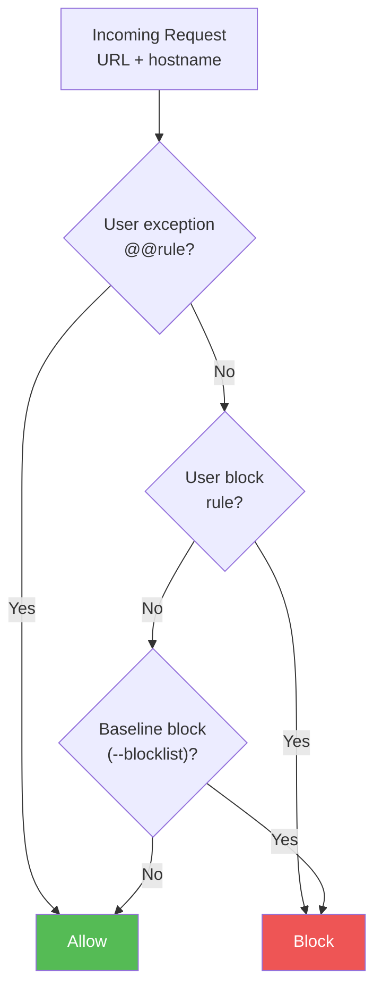
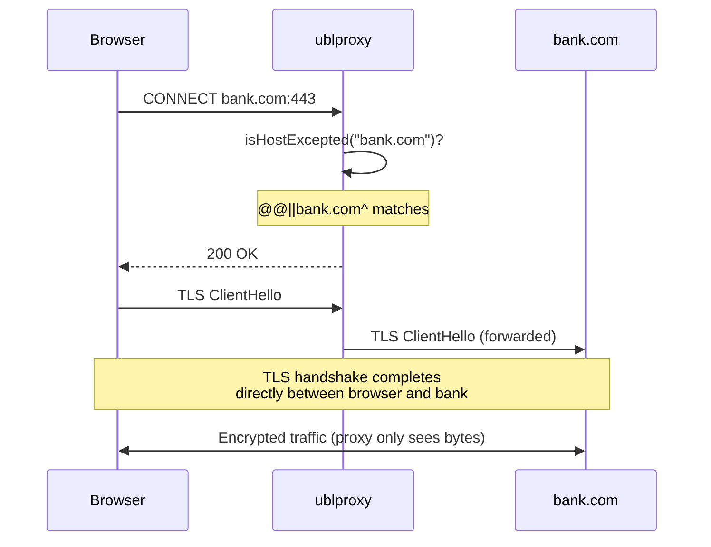
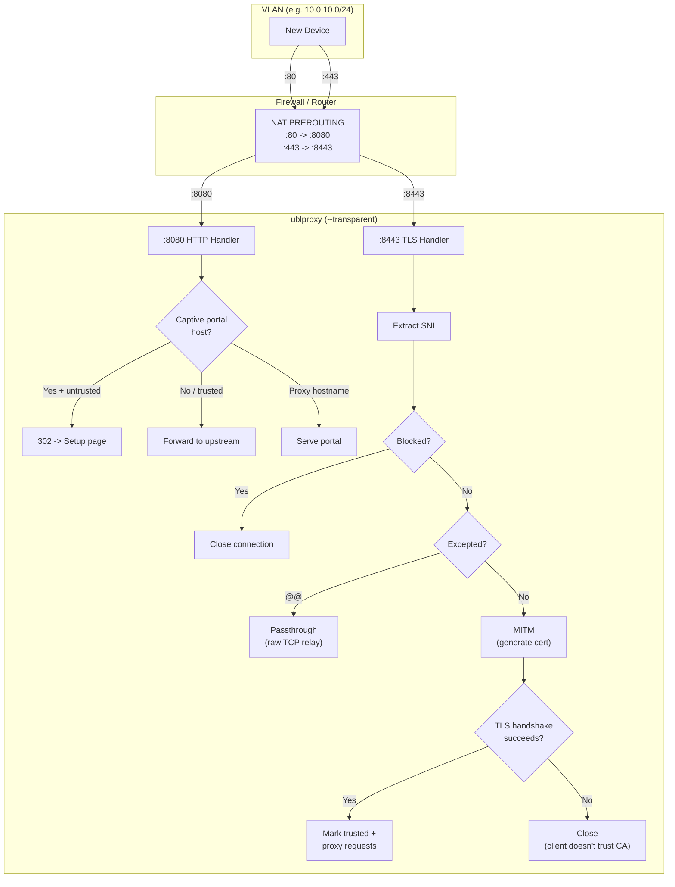
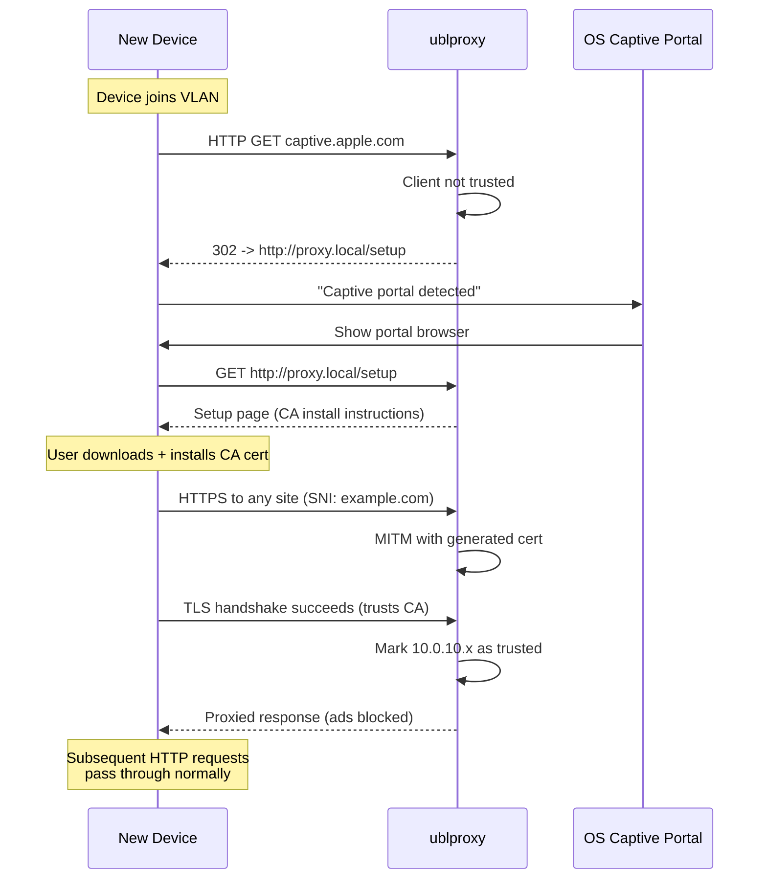

# Quick Start

## Run locally

```bash
go build -o ublproxy .
./ublproxy
```

## Run with Docker

```bash
docker run -d \
  -p 8080:8080 \
  -p 8443:8443 \
  -v ublproxy-data:/data \
  ghcr.io/andrioid/ublproxy:edge
```

### docker-compose.yml

```yaml
services:
  ublproxy:
    image: ghcr.io/andrioid/ublproxy:edge
    ports:
      - "8080:8080"
      - "8443:8443"
    volumes:
      - ublproxy-data:/data
    environment:
      - UBLPROXY_HOSTNAME=localhost
      - UBLPROXY_BLOCKLIST=https://easylist.to/easylist/easylist.txt,https://easylist.to/easylist/easyprivacy.txt
    restart: unless-stopped

volumes:
  ublproxy-data:
```

To use custom ports:

```yaml
services:
  ublproxy:
    image: ghcr.io/andrioid/ublproxy:edge
    ports:
      - "6080:6080"
      - "6443:6443"
    volumes:
      - ublproxy-data:/data
    environment:
      - UBLPROXY_HTTP_PORT=6080
      - UBLPROXY_HTTPS_PORT=6443
      - UBLPROXY_HOSTNAME=proxy.local
    restart: unless-stopped

volumes:
  ublproxy-data:
```

## Ports

The proxy listens on two ports:

- **HTTP** (default `8080`) — Setup page, CA certificate download, and mobile proxy (plain HTTP CONNECT for iOS/Android)
- **HTTPS** (default `8443`) — Proxy, management portal, and API

```mermaid
graph TB
    subgraph Explicit["Explicit Proxy Mode (default)"]
        direction TB
        E_HTTP[":8080 HTTP"]
        E_HTTPS[":8443 HTTPS"]

        E_HTTP --- E_H1["Setup page / CA download"]
        E_HTTP --- E_H2["Mobile proxy (CONNECT)"]
        E_HTTP --- E_H3["PAC files"]

        E_HTTPS --- E_S1["Desktop proxy (CONNECT)"]
        E_HTTPS --- E_S2["Management portal"]
        E_HTTPS --- E_S3["API + WebAuthn"]
    end

    subgraph Transparent["Transparent Proxy Mode (--transparent)"]
        direction TB
        T_HTTP[":8080 HTTP"]
        T_HTTPS[":8443 HTTPS"]

        T_HTTP --- T_H1["Captive portal redirect"]
        T_HTTP --- T_H2["HTTP traffic forwarding"]
        T_HTTP --- T_H3["Setup page (on proxy hostname)"]

        T_HTTPS --- T_S1["SNI extraction + MITM"]
        T_HTTPS --- T_S2["Passthrough tunneling"]
        T_HTTPS --- T_S3["Portal (on proxy hostname)"]
    end
```



## Blocklists

The `--blocklist` flag loads adblock filter lists into the baseline, applying to all traffic (authenticated and unauthenticated). You can specify it multiple times:

```bash
./ublproxy \
  --blocklist https://easylist.to/easylist/easylist.txt \
  --blocklist https://easylist.to/easylist/easyprivacy.txt
```

With environment variables (comma-separated):

```bash
UBLPROXY_BLOCKLIST="https://easylist.to/easylist/easylist.txt,https://easylist.to/easylist/easyprivacy.txt" ./ublproxy
```

In docker-compose:

```yaml
environment:
  - UBLPROXY_BLOCKLIST=https://easylist.to/easylist/easylist.txt,https://easylist.to/easylist/easyprivacy.txt
```

Authenticated users can add their own subscriptions (EasyList, EasyPrivacy, etc.) via the portal's Subscriptions page, which includes a "Popular Lists" section with one-click buttons.

## Install the CA certificate

The proxy generates a CA certificate on first run. Your browser must trust this certificate for HTTPS filtering to work.

1. Visit `http://<host>:<http-port>/` (e.g. `http://localhost:8080/`) to download the CA certificate
2. Install and trust it on your platform — the setup page has detailed instructions for macOS, iOS, Android, Linux, Windows, and Firefox
3. **Restart your browser** after trusting the certificate — browsers cache certificate trust state and won't pick up changes until restarted

When running with Docker, the CA certificate persists in the mounted `/data` volume. Download it from the HTTP setup page or copy it directly from the volume (`ca.crt`).

## Configure your browser

The setup page at `http://<host>:<http-port>/` provides a PAC (Proxy Auto-Configuration) URL that routes all external traffic through the proxy. Configure it in your browser or OS network settings.

Alternatively, set `https://<host>:<https-port>` as an HTTPS proxy manually.

### Mobile devices (iOS / Android)

Mobile devices cannot use the HTTPS proxy because iOS and Android don't support the `HTTPS` PAC proxy type. Use the mobile-specific PAC URL instead:

1. Open `http://<host>:<http-port>/` on your phone (scan the QR code on the setup page)
2. Download and install the CA certificate (see the setup page for platform-specific steps)
3. Configure your Wi-Fi proxy to **Automatic** with the URL: `http://<host>:<http-port>/mobile.pac`

The mobile PAC file routes traffic through the plain HTTP proxy on port 8080. Ad blocking and element hiding work identically to the desktop proxy. The element picker is not available on mobile connections.

## Custom rules

Rules are evaluated in layers. User exceptions take the highest priority, followed by user blocks, then baseline blocks from `--blocklist` flags.



### 1. Register an account

Visit `https://<host>:<https-port>/` and register a passkey. No username or password — the passkey is your identity. Anyone on the network can register.

### 2. Pick elements to block

Browse any website through the proxy and press **Alt+Shift+B** to open the element picker.

1. **Hover** over an element — a red highlight shows what will be selected
2. **Click** to select it — the generated CSS selector appears in the panel
3. **Block element** saves the rule and immediately hides the element
4. **Escape** to deselect, or close the picker entirely

Rules are stored in SQLite and take effect on the next page load.

### 3. Manage rules via the API

All endpoints require a Bearer token from the login flow.

```bash
# List your rules
curl -s https://localhost:8443/api/rules \
  -H "Authorization: Bearer <token>"

# Create a rule
curl -s https://localhost:8443/api/rules \
  -X POST -H "Content-Type: application/json" \
  -H "Authorization: Bearer <token>" \
  -d '{"rule": "example.com##.ad-banner", "domain": "example.com"}'

# Disable a rule
curl -s https://localhost:8443/api/rules/1 \
  -X PATCH -H "Content-Type: application/json" \
  -H "Authorization: Bearer <token>" \
  -d '{"enabled": false}'

# Delete a rule
curl -s https://localhost:8443/api/rules/1 \
  -X DELETE -H "Authorization: Bearer <token>"
```

Rules follow [adblock filter syntax](https://adblockplus.org/filter-cheatsheet). Element hiding rules use `domain##selector` format.

## Passthrough exceptions

Domains with a `@@` host-level exception rule are tunneled directly without MITM interception. The proxy relays encrypted bytes between client and upstream without seeing the traffic content. This is useful for sensitive sites like banking where you don't want the proxy to inspect traffic.



**Global exception** (in a blocklist file passed via `--blocklist`):

```
@@||bankofamerica.com^
@@||chase.com^
```

**Per-user exception** (via the portal UI or API):

```bash
curl -s https://localhost:8443/api/rules \
  -X POST -H "Content-Type: application/json" \
  -H "Authorization: Bearer <token>" \
  -d '{"rule": "@@||bankofamerica.com^"}'
```

Exception rules match the domain and all subdomains (e.g. `@@||bankofamerica.com^` also covers `www.bankofamerica.com`, `login.bankofamerica.com`, etc.).

Per-user exceptions only affect that user's traffic. Other users still get normal MITM filtering for the same domain unless they also add an exception.

## Transparent proxy mode

Transparent mode intercepts traffic redirected by a firewall without requiring any proxy configuration on client devices. Clients only need to install the CA certificate — the captive portal guides them through this.

```bash
./ublproxy --transparent --hostname=proxy.local \
  --blocklist https://easylist.to/easylist/easylist.txt
```

### How it works

1. A firewall rule redirects all port 80/443 traffic from a VLAN to the ublproxy ports
2. When a new device connects, its HTTP requests are intercepted and a captive portal page is shown with CA certificate installation instructions
3. Once the CA is installed, HTTPS MITM ad-blocking works transparently
4. The management portal is accessible at the proxy's own hostname/IP



### Device onboarding flow



### Firewall setup (Linux, iptables)

Redirect traffic from a VLAN interface (e.g. `br-vlan10`) to ublproxy. The proxy itself must be excluded to prevent loops.

```bash
# Get the UID of the ublproxy process (run as a dedicated user)
PROXY_UID=$(id -u ublproxy)

# Redirect HTTP (port 80) to ublproxy HTTP port
iptables -t nat -A PREROUTING -i br-vlan10 -p tcp --dport 80 \
  -j REDIRECT --to-port 8080

# Redirect HTTPS (port 443) to ublproxy HTTPS port
iptables -t nat -A PREROUTING -i br-vlan10 -p tcp --dport 443 \
  -j REDIRECT --to-port 8443

# Exclude proxy's own outbound traffic from redirection (prevents loops)
iptables -t nat -A OUTPUT -m owner --uid-owner $PROXY_UID -j RETURN
```

### Firewall setup (Linux, nftables)

```bash
table ip nat {
  chain prerouting {
    type nat hook prerouting priority dstnat;

    # Redirect VLAN traffic to ublproxy
    iifname "br-vlan10" tcp dport 80 redirect to :8080
    iifname "br-vlan10" tcp dport 443 redirect to :8443
  }

  chain output {
    type nat hook output priority -100;

    # Exclude proxy process from redirection
    meta skuid ublproxy return
  }
}
```

### Firewall setup (macOS, pf)

```
# /etc/pf.conf
rdr on en0 proto tcp from any to any port 80 -> 127.0.0.1 port 8080
rdr on en0 proto tcp from any to any port 443 -> 127.0.0.1 port 8443
```

```bash
sudo pfctl -f /etc/pf.conf
sudo pfctl -e
```

### Docker (transparent mode)

```yaml
services:
  ublproxy:
    image: ghcr.io/andrioid/ublproxy:edge
    network_mode: host   # required for transparent proxy
    environment:
      - UBLPROXY_TRANSPARENT=true
      - UBLPROXY_HOSTNAME=proxy.local
      - UBLPROXY_BLOCKLIST=https://easylist.to/easylist/easylist.txt
    volumes:
      - ublproxy-data:/data
    restart: unless-stopped

volumes:
  ublproxy-data:
```

Network mode `host` is required so ublproxy receives the redirected traffic directly. The firewall rules must be configured on the Docker host.

### Captive portal

When a device first connects to the VLAN, its OS performs a connectivity check (e.g. `captive.apple.com` for iOS/macOS, `connectivitycheck.gstatic.com` for Android). In transparent mode, ublproxy intercepts these HTTP requests from devices that haven't installed the CA certificate and redirects them to the setup page. The OS detects this as a captive portal and shows the setup page in a browser window.

Once the CA certificate is installed and the device makes a successful HTTPS connection through the proxy, the device is marked as trusted and captive portal redirects stop.

### Passthrough behavior

Passthrough (`@@||domain^`) works the same as in explicit mode. The proxy extracts the SNI hostname from the TLS ClientHello, checks exception rules, and relays the raw TCP connection to the upstream server without MITM.

### Limitations

- **No SNI = no proxy**: Clients that don't send the SNI extension in TLS ClientHello (very rare) cannot be proxied. The connection is closed.
- **HTTP-only captive portal**: The captive portal is triggered via HTTP connectivity checks. If a device only makes HTTPS requests, the captive portal won't trigger (the TLS handshake will fail with a certificate error instead).
- **No WebAuthn in transparent mode**: The management portal is served over HTTPS on the proxy's hostname, but WebAuthn requires a stable origin. Configure `--hostname` with a domain name (not an IP) for WebAuthn to work.

## CLI flags and environment variables

All flags can also be set via environment variables. Environment variables take precedence over defaults but CLI flags take precedence over environment variables.

| Flag | Env var | Default | Description |
|------|---------|---------|-------------|
| `--addr` | `UBLPROXY_ADDR` | `0.0.0.0` | Address to listen on |
| `--http-port` | `UBLPROXY_HTTP_PORT` | `8080` | HTTP port for setup page, CA certificate download, and mobile proxy |
| `--https-port` | `UBLPROXY_HTTPS_PORT` | `8443` | HTTPS port for proxy, portal, and API |
| `--hostname` | `UBLPROXY_HOSTNAME` | `localhost` | Portal hostname for WebAuthn and TLS cert (must be a domain, not an IP) |
| `--ca-dir` | `UBLPROXY_CA_DIR` | `~/.ublproxy` | Directory for CA certificate and key |
| `--db` | `UBLPROXY_DB` | `~/.ublproxy/ublproxy.db` | Path to SQLite database |
| `--blocklist` | `UBLPROXY_BLOCKLIST` | *(none)* | Path or URL to a blocklist file (repeatable, comma-separated in env var) |
| `--transparent` | `UBLPROXY_TRANSPARENT` | `false` | Run in transparent proxy mode (intercept redirected traffic) |
| `--log-level` | `UBLPROXY_LOG_LEVEL` | `info` | Log verbosity: `debug`, `info`, `warn`, `error`. Use `debug` to log all proxied requests. |
