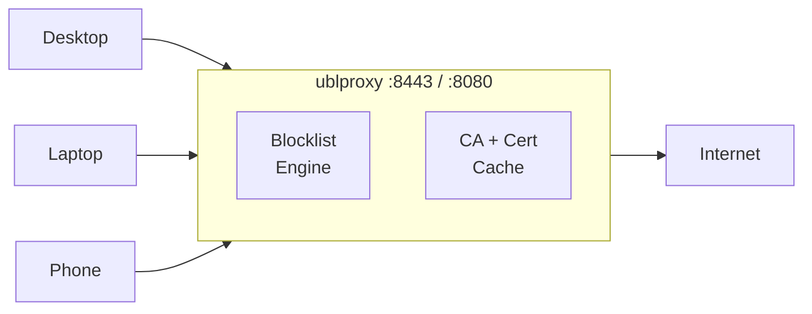
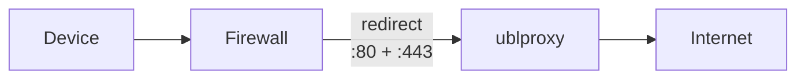
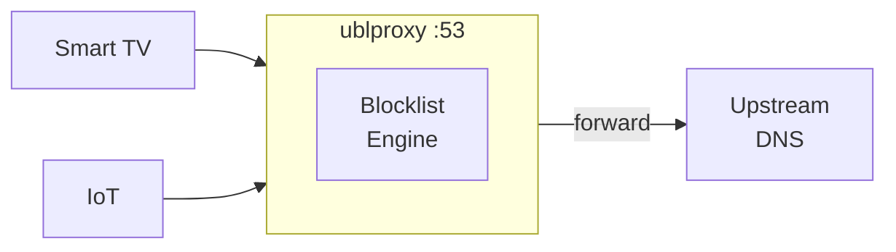

# ublproxy

A network-wide adblock proxy-server w. adblock list support, custom rules and passkey users. Easy to set up and host yourself.

## Problem domain

Browsers were supposed to be "user-agents", but modern browsers are far more catered to ad-selling corporations, than they are to users.

Existing solutions, such as [pihole](https://pi-hole.net/) and other dns-based solutions are only sufficient, if you want to block an entire hostname. Browser extensions used to work well, but with the latest [Manifest changes](https://adlock.com/blog/chrome-killing-adblock/), they are not as effective as they used to be.

## Architecture

ublproxy sits between your devices and the internet, intercepting HTTP/HTTPS traffic to block ads and tracking at the network level. It operates in three modes:

### Explicit proxy mode (default)

Browsers are configured to send traffic through the proxy via PAC files or manual proxy settings.

### Transparent proxy mode (`--transparent`)

A firewall redirects all traffic from a VLAN to the proxy. No client configuration needed.

### DNS resolver (`--dns-port`)

For devices that can't install a CA certificate. Blocked hostnames return `0.0.0.0`, everything else is forwarded upstream.

## Features

### Adblock filter lists

Subscribe to community-maintained blocklists like EasyList, EasyPrivacy, and uBlock Filters. Lists are fetched and parsed automatically. Supports the [Adblock Plus filter syntax](https://adblockplus.org/filter-cheatsheet) and many [uBlock Origin extensions](https://github.com/gorhill/uBlock/wiki/Static-filter-syntax) — see [ADBLOCK_SYNTAX.md](ADBLOCK_SYNTAX.md) for the full matrix.

### Custom rules

Add your own blocking and element-hiding rules using adblock filter syntax, or use the interactive element picker (Alt+Shift+B) to visually select elements to hide on any proxied page.

### Encrypted, all the way

Desktop browsers connect to the proxy over HTTPS. The proxy generates per-host TLS certificates on the fly using its own CA. Mobile devices (iOS/Android) connect over plain HTTP because they don't support HTTPS proxy connections — the MITM tunnel within the connection is still TLS-encrypted.

### Strips away scripts, images and embeds

Blocked requests for scripts, images, iframes and other embedded resources are stopped at the proxy before they reach your browser. Blocked resources can be replaced with neutered placeholders (`$redirect`) to satisfy anti-adblock detection.

### Hides the rest

CSS is injected into HTML responses to hide elements matching element-hiding rules. The proxy decompresses HTML (gzip, brotli, zstd), injects the CSS, and serves it back — removing ad containers, banners and other unwanted elements visually.

### Scriptlet injection

11 commonly-used scriptlets (`##+js()`) are injected as `<script>` tags to neutralize anti-adblock scripts, prevent tracking, and modify page behavior. Includes `set-constant`, `abort-on-property-read`, `addEventListener-defuser`, `nowebrtc`, `prevent-fetch`, and more.

### Users and custom rules

WebAuthn passkey authentication gives each user their own set of rules and subscriptions, layered on top of any server-configured blocklists.

### Transparent proxy mode

Deploy on a VLAN with firewall rules to intercept all traffic automatically — no client-side proxy configuration needed. A captive portal guides new devices through CA certificate installation. Enable with `--transparent`.

### DNS resolver

Built-in DNS resolver for devices that can't install a CA certificate — smart TVs, game consoles, IoT devices. Queries for blocked hostnames return `0.0.0.0` / `::`, everything else is forwarded to an upstream resolver. Uses the same blocklists and per-user rules as the proxy (matched by client IP). Enable with `--dns-port 53`.

## Filter syntax support

ublproxy implements the [Adblock Plus filter syntax](https://adblockplus.org/filter-cheatsheet) and the most-used [uBlock Origin extensions](https://github.com/gorhill/uBlock/wiki/Static-filter-syntax). Tested against EasyList (87K lines), uBlock Filters (11K lines, 2,500+ scriptlets), and EasyPrivacy with zero crashes and minimal parse errors.

| Category | What's supported |
|----------|-----------------|
| **Network patterns** | Literal, wildcard `*`, separator `^`, anchors `\|`/`\|\|`, regex `/pattern/`, HOSTS format |
| **Filter options** | `$script`, `$image`, `$css`, `$xhr`, `$frame`, `$media`, `$font`, `$doc`, `$ping`, `$all`, `$third-party`/`$3p`, `$domain=`, `$to=`, `$denyallow=`, `$method=`, `$match-case` |
| **Priority** | `$important`, `$badfilter`, exception filters `@@` |
| **Modifiers** | `$redirect` (19 neutered resources), `$removeparam`, `$csp`, `$permissions`, `$header` |
| **Cosmetic** | Element hiding `##`, exceptions `#@#`, `$elemhide`, `$generichide`, `$specifichide` |
| **Scriptlets** | `##+js()` with 11 scriptlets, `#@#+js()` exceptions |
| **Directives** | `!#if`/`!#else`/`!#endif` with boolean expressions |
| **Entity matching** | `google.*` in `$domain=`, `$to=`, `$denyallow=`, cosmetic filters |

See [ADBLOCK_SYNTAX.md](ADBLOCK_SYNTAX.md) for the complete support matrix.

## Security

### Man-In-The-Middle

It's important to be aware, that by using this solution, you're essentially decrypting all of your traffic, messing with it and then encrypting it again before it reaches the browser. If ublproxy was a service on the Internet, that should make you very suspicious. But, this is intended to be run on small local networks to improve privacy, and ad-free browsing.

## Known limitations

- **No re-compression**: After decompressing HTML (gzip/brotli/zstd) for CSS injection, HTML is served uncompressed to the client. This is fine when the proxy runs on localhost.
- **Session-to-IP mapping**: Sessions are bound to client IP. Multiple users behind the same NAT IP share a single session slot (last login wins).
- **Mobile proxy connection is unencrypted**: iOS and Android don't support HTTPS proxy connections. Mobile devices use a plain HTTP CONNECT proxy on port 8080. The CONNECT metadata (target hostname) is visible on the LAN, though the tunneled content is TLS-encrypted. The element picker is disabled on mobile connections to avoid leaking the session token.

## Comparison with DNS-based blockers

Solutions like [Pi-hole](https://pi-hole.net/) and [AdGuard Home](https://github.com/AdguardTeam/AdGuardHome) block ads at the DNS level by resolving ad-serving domains to a sinkhole address. ublproxy takes a different approach — it operates as an HTTPS proxy, intercepting and modifying traffic at the HTTP layer.

### Advantages

- **URL-path blocking**: DNS blockers can only block entire hostnames. ublproxy can block specific paths (e.g. `/ads/banner.js`) while allowing legitimate content from the same domain.
- **Cosmetic filtering**: HTML responses are modified before reaching the browser — blocked resource elements are stripped and CSS is injected to hide ad containers. DNS blockers leave empty ad placeholders.
- **Comprehensive filter syntax**: Supports Adblock Plus syntax and uBlock Origin extensions — network patterns, content-type options, `$redirect`, `$removeparam`, `$csp`, scriptlet injection (`##+js()`), element hiding, and pre-parsing directives. Not just domain lists.
- **Resilient to anti-adblock**: Works against scripts that detect DNS-level blocking or missing ad resources, since responses are modified at the content level.
- **Per-user rules**: Each user authenticates with a passkey and maintains their own rules and subscriptions, layered on top of server-wide blocklists.

### Disadvantages

- **CA certificate required**: Every device must trust the proxy's CA certificate. This adds setup friction and has security implications — the proxy can decrypt all HTTPS traffic.
- **Certificate-pinned apps**: Some apps (banking, security) use certificate pinning and will reject the proxy's MITM certificates. The proxy detects repeated handshake failures and automatically switches these hosts to passthrough. You can also manually add passthrough rules (`@@||domain^`).
- **Higher resource usage**: Decrypting, inspecting, and re-encrypting every HTTPS connection is more resource-intensive than responding to DNS queries.
- **More complex setup**: Requires proxy configuration (PAC files or transparent mode with firewall rules) on top of CA certificate installation, compared to just changing a DNS server address.
- **HTTP-only**: Does not block non-HTTP traffic. DNS blockers intercept all protocols (QUIC, raw TCP, etc.) at the domain level.
- **Proxy-unaware apps**: Apps that ignore system proxy settings won't be filtered unless transparent mode with firewall rules is configured.

### Complementary use

These approaches aren't mutually exclusive. A DNS blocker can handle the bulk of known ad domains cheaply, while ublproxy handles the cases DNS blocking can't reach — same-origin ads, cosmetic filtering, and URL-path-specific rules.

ublproxy also includes a built-in DNS resolver (`--dns-port`) that null-routes blocked hostnames for devices that can't install a CA certificate. This provides host-level blocking without needing a separate DNS blocker, though it only covers the host-level rules from your blocklists — URL-path blocking, cosmetic filtering, and scriptlet injection still require the proxy.

## References

- See [QUICK_START.md](QUICK_START.md) for setup instructions (local and Docker).
- See [ADBLOCK_SYNTAX.md](ADBLOCK_SYNTAX.md) for the full filter syntax support matrix.
- See [CONTRIBUTING.md](CONTRIBUTING.md) for development.
