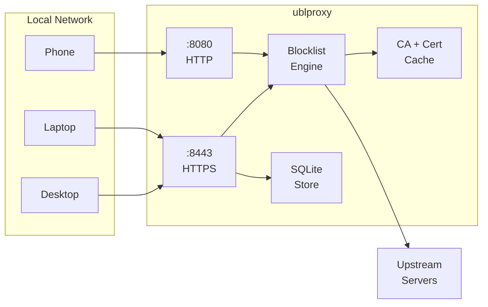
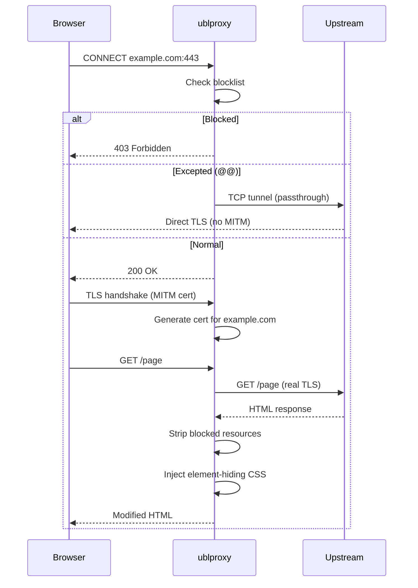
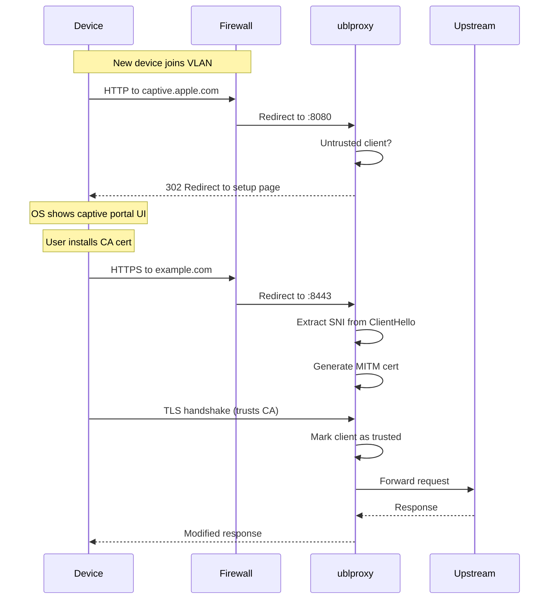

# ublproxy

A network-wide adblock proxy-server w. adblock list support, custom rules and passkey users. Easy to set up and host yourself.

## Problem domain

Browsers were supposed to be "user-agents", but modern browsers are far more catered to ad-selling corporations, than they are to users.

Existing solutions, such as [pihole](https://pi-hole.net/) and other dns-based solutions are only sufficient, if you want to block an entire hostname. Browser extensions used to work well, but with the latest [Manifest changes](https://adlock.com/blog/chrome-killing-adblock/), they are not as effective as they used to be.

## Architecture

ublproxy sits between your devices and the internet, intercepting HTTP/HTTPS traffic to block ads and tracking at the network level.

The proxy operates in one of two modes:

### Explicit proxy mode (default)

Browsers are configured to send traffic through the proxy via PAC files or manual proxy settings.

### Transparent proxy mode (`--transparent`)

A firewall redirects all traffic from a VLAN to the proxy. No client configuration needed.

## Features

### Adblock Plus lists

Subscribe to community-maintained blocklists like EasyList and EasyPrivacy. Lists are fetched and parsed automatically, and rules are applied to all proxied traffic.

### Custom rules

Add your own blocking and element-hiding rules using adblock filter syntax, or use the interactive element picker (Alt+Shift+B) to visually select elements to hide on any proxied page.

### Encrypted, all the way

Desktop browsers connect to the proxy over HTTPS. The proxy generates per-host TLS certificates on the fly using its own CA. Mobile devices (iOS/Android) connect over plain HTTP because they don't support HTTPS proxy connections — the MITM tunnel within the connection is still TLS-encrypted.

### Strips away scripts, images and embeds

Blocked requests for scripts, images, iframes and other embedded resources are stopped at the proxy before they reach your browser.

### Hides the rest

CSS is injected into HTML responses to hide elements matching element-hiding rules. The proxy decompresses HTML, injects the CSS, and serves it back — removing ad containers, banners and other unwanted elements visually.

### Users and custom rules

WebAuthn passkey authentication gives each user their own set of rules and subscriptions, layered on top of any server-configured blocklists.

### Transparent proxy mode

Deploy on a VLAN with firewall rules to intercept all traffic automatically — no client-side proxy configuration needed. A captive portal guides new devices through CA certificate installation. Enable with `--transparent`.

## Security

### Man-In-The-Middle

It's important to be aware, that by using this solution, you're essentially decrypting all of your traffic, messing with it and then encrypting it again before it reaches the browser. If ublproxy was a service on the Internet, that should make you very suspicious. But, this is intended to be run on small local networks to improve privacy, and ad-free browsing.

## Known limitations

- **No re-compression**: After decompressing HTML (gzip/brotli/zstd) for CSS injection, HTML is served uncompressed to the client. This is fine when the proxy runs on localhost.
- **Session-to-IP mapping**: Sessions are bound to client IP. Multiple users behind the same NAT IP share a single session slot (last login wins).
- **Mobile proxy connection is unencrypted**: iOS and Android don't support HTTPS proxy connections. Mobile devices use a plain HTTP CONNECT proxy on port 8080. The CONNECT metadata (target hostname) is visible on the LAN, though the tunneled content is TLS-encrypted. The element picker is disabled on mobile connections to avoid leaking the session token.

## References

- See [QUICK_START.md](QUICK_START.md) for setup instructions (local and Docker).
- See [CONTRIBUTING.md](CONTRIBUTING.md) for development.
- See [adblock rules cheatsheet](https://adblockplus.org/filter-cheatsheet) for adblock plus filter syntax details.
